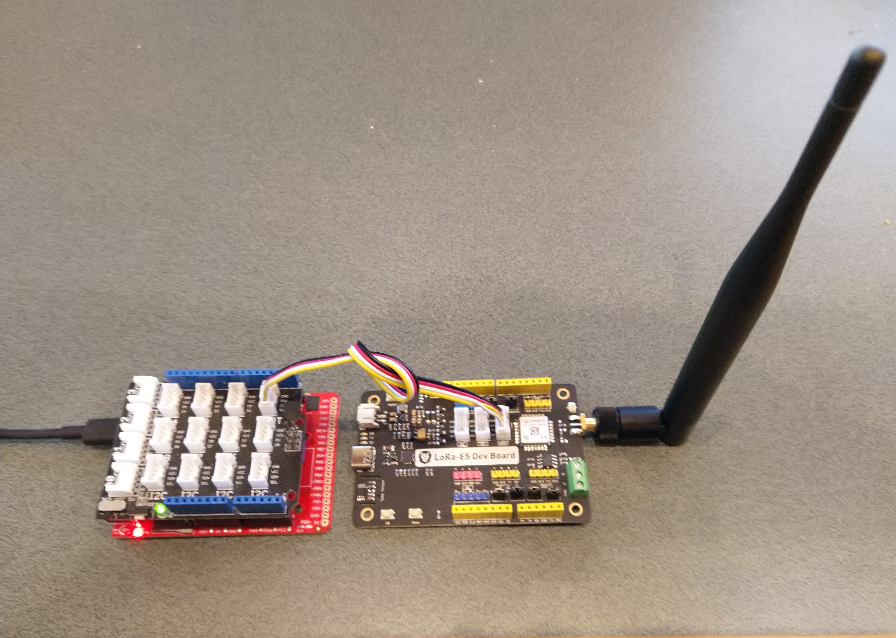

# SeeedLoRaE5LoRaWAN-TinyCLR
A C# library for LoRaWAN connectivity for [Seeed](https://www.seeedstudio.com/) [LoRa-E5 Module](https://www.seeedstudio.com/LoRa-E5-Wireless-Module-p-4745.html) equipped [GHI Electronics TinyCLR](https://www.ghielectronics.com/tinyclr/) powered devices.

The repo has the source code for the series of blog posts written as I built this library. This library is "inspired" by my [.NET nanoFramework RAK811 LoRaWAN library](https://github.com/KiwiBryn/RAK811LoRaWAN-NetNF)

01. [Basic connectivity](https://blog.devmobile.co.nz/2021/04/30/tinyclr-os-v2-seeed-lora-e5-lorawan-library-part1/)
02.

